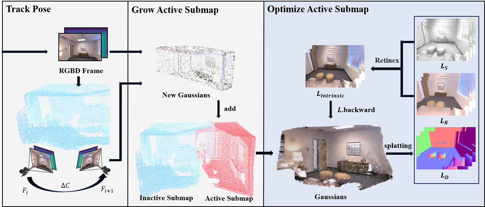

# intrinsicGSlam

## Overview

    

## Installation

#### Clone
```
git clone https://github.com/lee12332/intrinsicGSlam.git
```
#### Create the enviroment
```
conda env create -f environment.yml
conda activate igslam
pip install ./submodule/r3dg-rasterization
pip install ./submodule/simple-knn
```

## Dataset
your dataset path should be organized like this:
```
-dataset
    -Replica
        -room0
            -results
                -depth000000.png
                ...
                -depth001999.png
                -frame000000.jpg
                ...
                -frame001999.jpg
            -traj.txt
```

## Training
```
run_slam.py configs/Replica/room0.yaml
```

## Acknowledgments
```
@article{Lyu2025multi,
  title={Multi-view intrinsic decomposition of indoor scenes under a 3D Gaussian splatting framework},
  author={Lyu Hengye， Liu Yanli， Li Hong， Yuan Xia， Xing Guanyu},
  journal={Journal of Image and Graphics， 30(7):2514-2527 DOI： 10.11834/jig.240505},
  year={2023}
}

@article{yugay2023gaussian,
  title={Gaussian-slam: Photo-realistic dense slam with gaussian splatting},
  author={Yugay, Vladimir and Li, Yue and Gevers, Theo and Oswald, Martin R},
  journal={arXiv preprint arXiv:2312.10070},
  year={2023}
}
```

